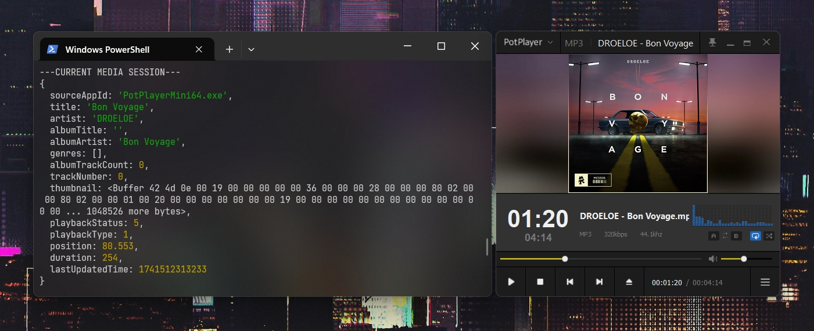

# Node-Windows-SMTC-Monitor

<a href="https://github.com/LeagueTavern/node-windows-smtc-monitor/issues"></a>
<a href="https://github.com/LeagueTavern/node-windows-smtc-monitor/actions"></a>
<a href="https://nodejs.org/en/about/releases/"></a>
<a href="https://www.npmjs.com/package/@coooookies/windows-smtc-monitor"></a>
<a href="https://npmcharts.com/compare/@coooookies/windows-smtc-monitor?minimal=true"></a>



> This is a [Node.js](https://nodejs.org/) toolkit for listening to [SMTC](https://learn.microsoft.com/en-us/uwp/api/windows.media.control.globalsystemmediatransportcontrolssessionmanager?view=winrt-26100) (System Media Transport Controls) media events in Windows. It is written in [Rust](https://www.rust-lang.org/) and utilizes [napi-rs](https://napi.rs/) to implement bindings with Node.js.

## ⚠️ Warning

`node-windows-smtc-monitor` only supports Windows 10 1809 and later versions (>= 10.0.17763)

## 🚀 Features

- Listen to media events such as play, pause, next track, previous track.
- Get the current playback state and track information.
- Support for both JavaScript and TypeScript.
- Easy to use and integrate into existing Node.js applications.

## Installation

```shell
npm i @coooookies/windows-smtc-monitor
```

## 🍊 Example

[CommonJS Example](example/index.js) <br />
[ESModule Example](example/index.mjs) <br />
[TypeScript Example](example/index.ts) <br />

## Usage

#### Importing the library

```Typescript
// Typescript & ESModule
import { SMTCMonitor } from '@coooookies/windows-smtc-monitor';

// CommonJS
const { SMTCMonitor } = require('@coooookies/windows-smtc-monitor');
```

#### Gets all media sessions

Gets all of the available sessions.

```Typescript
const sessions = SMTCMonitor.getMediaSessions(); // MediaInfo[]
// [
//   {
//     sourceAppId: 'PotPlayerMini64.exe',
//     media: {
//       title: 'ぱられループ を歌ってみた (Jeku remix)',
//       artist: 'Jeku/aori',
//       albumTitle: '',
//       albumArtist: 'ぱられループ を歌ってみた (Jeku remix)',
//       genres: [],
//       albumTrackCount: 0,
//       trackNumber: 0,
//       thumbnail: <Buffer 42 4d 0e ... 1048526 more bytes> // The Album Cover/Thumbnail in Buffer
//     },
//     playback: { playbackStatus: 4, playbackType: 1 },
//     timeline: { position: 217.228, duration: 259 },
//     lastUpdatedTime: 1740000000000
//   },
//   {
//     sourceAppId: 'player.exe',
//     media: { ... },
//     playback: { ... },
//     timeline: { ... },
//     lastUpdatedTime: 1740000000000
//   }
// ]
```

#### Gets the current media session

Gets the current session. This is the session the system believes the user would most likely want to control.

```Typescript
const session = SMTCMonitor.getCurrentMediaSession(); // MediaInfo | null
// {
//   sourceAppId: 'PotPlayerMini64.exe',
//   media: { ... },
//   playback: { ... },
//   timeline: { ... },
//   lastUpdatedTime: 1740000000000
// }
```

#### Gets the specified media session

Gets the specified session by the sourceAppId.

```Typescript
const session = SMTCMonitor.getMediaSessionByAppId('player.exe'); // MediaInfo | null
// {
//   sourceAppId: 'player.exe',
//   media: { ... },
//   playback: { ... },
//   timeline: { ... },
//   lastUpdatedTime: 1740000000000
// }
```

#### Using Listeners

If you need to continuously listen for media events, you might consider using the `getMediaSessions` method for polling. However, this approach can be resource-intensive. Instead, `node-windows-smtc-monitor` provides a listener class that allows you to listen for events such as
[GlobalSystemMediaTransportControlsSessionManager.CurrentSessionChanged](https://learn.microsoft.com/en-us/uwp/api/windows.media.control.globalsystemmediatransportcontrolssessionmanager.currentsessionchanged?view=winrt-26100)
[GlobalSystemMediaTransportControlsSessionManager.SessionsChanged](https://learn.microsoft.com/en-us/uwp/api/windows.media.control.globalsystemmediatransportcontrolssessionmanager.sessionschanged?view=winrt-26100)
and other related events to monitor media sessions efficiently.

```Typescript
// Register the monitor
const monitor = new SMTCMonitor();

// Normal use
monitor.on('session-media-changed', (appId, mediaProps) => {
  console.log(`Media info changed for ${appId}`, mediaProps);
});

// Using a listener defined outside
const listener = (appId, playbackInfo) => {
  console.log(`Playback state changed for ${appId}`, playbackInfo);
};

monitor.on('session-playback-changed', listener); // Register the listener
monitor.off('session-playback-changed', listener); // Unregister the listener

console.log(monitor.sessions)
// Shows all the sessions

// Destroy monitoring when done
// monitor.destroy();
```

Here is a list of available events:

| Event Name               | Description                                 | Parameters                                    |
| ------------------------ | ------------------------------------------- | --------------------------------------------- |
| session-media-changed    | Triggered when media info changes           | (appId: string, mediaProps: MediaProps)       |
| session-timeline-changed | Triggered when position or duration changes | (appId: string, timelineProps: TimelineProps) |
| session-playback-changed | Triggered when playback state changes       | (appId: string, playbackInfo: PlaybackInfo)   |
| session-added            | Triggered when a new media session is added | (appId: string, mediaInfo: MediaInfo)         |
| session-removed          | Triggered when a media session is removed   | (appId: string)                               |
| current-session-changed  | Triggered when the current session changes  | (appId: string)                               |

## Using in Electron

To use `node-windows-smtc-monitor` in Electron, you need to run it in a Worker thread. Running it in the main process will cause the main thread to lock up, which will freeze the renderer process. An example of how to use it in a Worker is provided in `example/worker.js`. <br />

[Worker Example](example/worker.js)

## License

This project is licensed under the [MIT](LICENSE) License.
