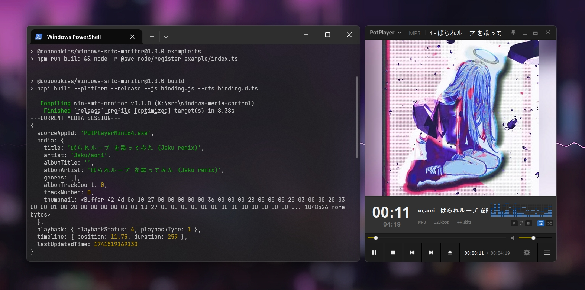

# Node-Windows-SMTC-Monitor

<a href="https://github.com/LeagueTavern/node-windows-smtc-monitor/issues"></a>
<a href="https://github.com/LeagueTavern/node-windows-smtc-monitor/actions"></a>
<a href="https://nodejs.org/en/about/releases/"></a>
<a href="https://www.npmjs.com/package/@coooookies/windows-smtc-monitor"></a>
<a href="https://npmcharts.com/compare/@coooookies/windows-smtc-monitor?minimal=true"></a>



> 本项目是一个用于监听 Windows 中 [SMTC](https://learn.microsoft.com/en-us/uwp/api/windows.media.control.globalsystemmediatransportcontrolssessionmanager?view=winrt-26100) (System Media Transport Controls) 媒体事件的 Node.js 工具包。使用 [napi-rs](https://napi.rs/) 实现与 Node.js 的绑定，由 [Rust](https://www.rust-lang.org/) 强力驱动。

[English](./README.md) | 简体中文

## ⚠️ 注意

`node-windows-smtc-monitor` 仅支持 Windows 10 1809 及更高版本 (>= 10.0.17763)

## 🚀 功能

- 监听媒体事件，例如播放、暂停、切歌。
- 获取当前播放状态和曲目信息。
- 支持 JavaScript 和 TypeScript。
- 易于使用并集成到现有的 Node.js 应用程序中。

## 安装

```shell
npm i @coooookies/windows-smtc-monitor
```

## 🍊 橘个栗子

[CommonJS Example](example/index.js) <br />
[ESModule Example](example/index.mjs) <br />
[TypeScript Example](example/index.ts) <br />

## 使用

#### 导入

```Typescript
// Typescript & ESModule
import { SMTCMonitor } from '@coooookies/windows-smtc-monitor';

// CommonJS
const { SMTCMonitor } = require('@coooookies/windows-smtc-monitor');
```

#### 获取所有媒体会话

获得所有可用的会话。

```Typescript
const sessions = SMTCMonitor.getMediaSessions(); // MediaInfo[]
// [
//   {
//     sourceAppId: 'PotPlayerMini64.exe',
//     media: {
//       title: 'ぱられループ を歌ってみた (Jeku remix)',
//       artist: 'Jeku/aori',
//       albumTitle: '',
//       albumArtist: 'ぱられループ を歌ってみた (Jeku remix)',
//       genres: [],
//       albumTrackCount: 0,
//       trackNumber: 0,
//       thumbnail: <Buffer 42 4d 0e ... 1048526 more bytes> // The Album Cover/Thumbnail in Buffer
//     },
//     playback: { playbackStatus: 4, playbackType: 1 },
//     timeline: { position: 217.228, duration: 259 },
//     lastUpdatedTime: 1740000000000
//   },
//   {
//     sourceAppId: 'player.exe',
//     media: { ... },
//     playback: { ... },
//     timeline: { ... },
//     lastUpdatedTime: 1740000000000
//   }
// ]
```

#### 获取当前媒体会话

获取当前会话。此会话是系统认为用户最有可能想要获得的会话。

```Typescript
const session = SMTCMonitor.getCurrentMediaSession(); // MediaInfo | null
// {
//   sourceAppId: 'PotPlayerMini64.exe',
//   media: { ... },
//   playback: { ... },
//   timeline: { ... },
//   lastUpdatedTime: 1740000000000
// }
```

#### 获取指定媒体会话

根据`sourceAppId`获取指定会话。

```Typescript
const session = SMTCMonitor.getMediaSessionByAppId('player.exe'); // MediaInfo | null
// {
//   sourceAppId: 'player.exe',
//   media: { ... },
//   playback: { ... },
//   timeline: { ... },
//   lastUpdatedTime: 1740000000000
// }
```

#### 善用监听器

如果你需要持续监听媒体事件，你也许会想到轮询 `getMediaSessions` 方法。但千万别这么做，这种方法可能会消耗大量下系统资源资源。如果你想要持续监听的话，`node-windows-smtc-monitor` 提供了一个监听器类以允许你监听事件，它是通过 [GlobalSystemMediaTransportControlsSessionManager.CurrentSessionChanged](https://learn.microsoft.com/en-us/uwp/api/windows.media.control.globalsystemmediatransportcontrolssessionmanager.currentsessionchanged?view=winrt-26100)
[GlobalSystemMediaTransportControlsSessionManager.SessionsChanged](https://learn.microsoft.com/en-us/uwp/api/windows.media.control.globalsystemmediatransportcontrolssessionmanager.sessionschanged?view=winrt-26100) 来实现的，通过系统级的回调可以高效地监控媒体会话。

```Typescript
// 注册监听器
const monitor = new SMTCMonitor();

// 监听媒体信息变化
monitor.on('session-media-changed', (appId, mediaProps) => {
  console.log(`Media info changed for ${appId}`, mediaProps);
});

// 外置监听函数
const listener = (appId, playbackInfo) => {
  console.log(`Playback state changed for ${appId}`, playbackInfo);
};

monitor.on('session-playback-changed', listener); // 注册外置监听函数
monitor.off('session-playback-changed', listener); // 注销外置监听函数

console.log(monitor.sessions)
// 显示所有监听中的会话

// 注销监听器
// monitor.destroy();
```

这里有一些可用的事件：

| 事件名称                 | 描述                         | 参数                                          |
| ------------------------ | ---------------------------- | --------------------------------------------- |
| session-media-changed    | 媒体信息变化时触发           | (appId: string, mediaProps: MediaProps)       |
| session-timeline-changed | 播放位置或持续时间变化时触发 | (appId: string, timelineProps: TimelineProps) |
| session-playback-changed | 播放状态变化时触发           | (appId: string, playbackInfo: PlaybackInfo)   |
| session-added            | 新的媒体会话添加时触发       | (appId: string, mediaInfo: MediaInfo)         |
| session-removed          | 媒体会话移除时触发           | (appId: string)                               |
| current-session-changed  | 当前会话变化时触发           | (appId: string)                               |

## 在 Electron 中使用

如果你想在 Electron 中使用 `node-windows-smtc-monitor`，你需要在 `Worker` 中运行它。在主进程中运行会导致主线程卡死，渲染进程将会被冻结。Worker 中运行的例子已在 `example/worker.js` 中提供<br />

[Worker Example](example/worker.js)

## 协议

此项目使用 [MIT](LICENSE) 协议进行许可。
